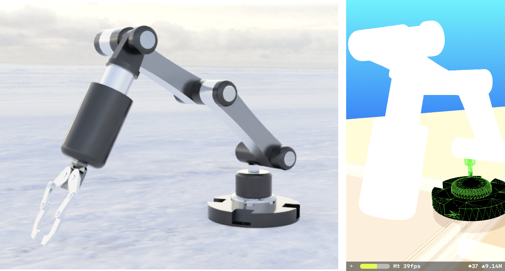

# SceneKitExtensions

This repository contains methods to set up Scene Kit properties. It has extensions to SCNNode, SCNScene, SCNView, and SCNVector3. Also, propose a base view controller called SCNViewController, which presets some scene properties and has some protocol methods. 

I am currently implementing five degrees of freedom robotic manipulator. The idea is to control it with the app.

 
